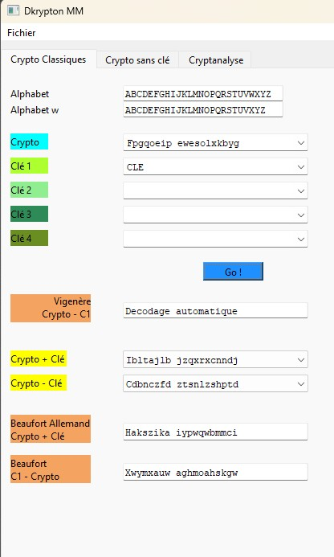
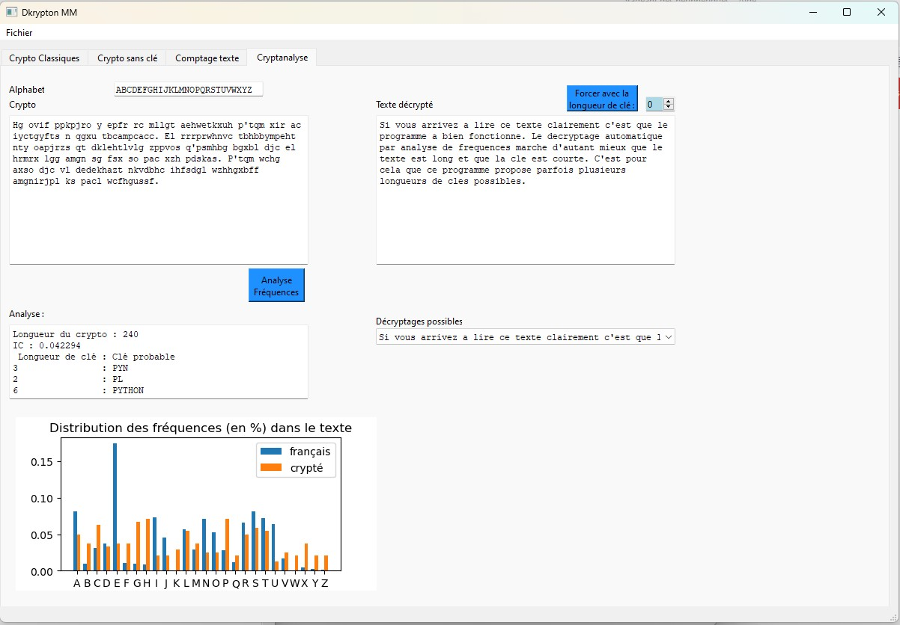

# dkrypton
Decipher / Cipher Software

---------
> __Warning__:  
<b>For personal use or commercial use at your own risk !   
This is only an amateur and personal project</b>  
---------

Decryption / Encryption of classical ciphers :
Vigenere, Beaufort, Cesar...

## REQUIREMENTS
As you can see in the code, you will need these python libraries :  
```
- sys
- functools
- PyQt6

```

## USAGE  
```diff
- Just launch Dkrypton.py and enjoy !
```


Tabs :  
**Crypto Classiques**:  
-> Enter a Crypto and a Clé 1 (key #1) and push the Go !  
**Crypto sans clé**:  
-> Enter a Crypto and push the Go !  
**Cryptanalyse**  
-> for automatic analysis and decryption (not yet in use)


## EXAMPLES :
<p float="left">

 
</p>

## NOTES :  
- a lot of ciphers will be add later
- sorry for my english, I'm just a frenchman :smiley:
